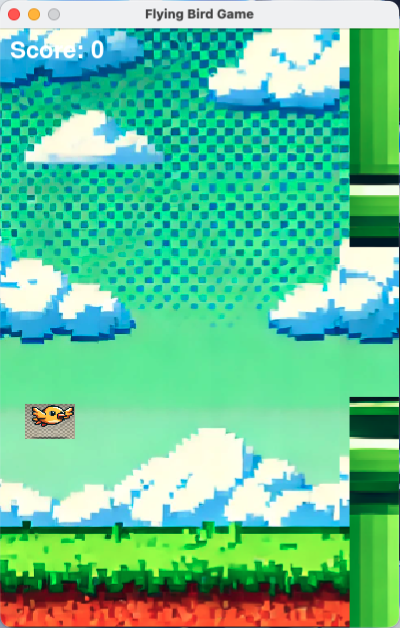

# Flying Bird Game

A simple "Flying Bird" game built using **Python** and **Pygame**. The player controls a bird that flies through a series of pipes by flapping its wings, avoiding collisions with the pipes or the ground.

## Table of Contents

- [Demo](#demo)
- [Features](#features)
- [Installation](#installation)
- [How to Play](#how-to-play)
- [Configuration](#configuration)
- [Project Structure](#project-structure)
- [Future Enhancements](#future-enhancements)
- [Contributing](#contributing)
- [License](#license)

## Demo

Here is a demo screenshot of the game in action:



## Features

- **Bird Flapping Mechanic**: The bird can be controlled by pressing the space bar to flap upward, with gravity pulling it down constantly.
- **Dynamic Pipes**: Pipes with random heights appear and move leftward, with increasing speed as the game progresses.
- **Score System**: Players earn points for successfully passing through the gaps between pipes.
- **Game Over Detection**: The game ends when the bird collides with pipes or the ground.
- **Background Scrolling**: An endless background scrolls to simulate forward flight.
- **Sound Effects**: Audio feedback for flapping and hitting obstacles.

## Installation

1. **Clone the repository**:
   ```bash
   git clone https://github.com/1998x-stack/flying_bird.git
   cd flying_bird
   ```

2. **Install dependencies**:
   Ensure you have Python 3.x installed, and install Pygame:
   ```bash
   pip install pygame
   ```

3. **Run the game**:
   Execute the `main.py` file to start the game.
   ```bash
   python main.py
   ```

## How to Play

- Press the **space bar** to make the bird flap its wings and move upward.
- Avoid colliding with the pipes and the ground.
- The speed of the pipes increases over time, making the game more challenging.
- Your score is displayed at the top of the screen and increases by 1 each time you pass through a pipe.

## Configuration

You can adjust the game settings by modifying the `config.py` file. Below are some key settings:

```python
# config.py

# Screen dimensions
SCREEN_WIDTH = 400
SCREEN_HEIGHT = 600

# Bird settings
BIRD_START_X = 50
BIRD_START_Y = 300
BIRD_SCALE = (50, 35)

# Gravity and flap strength
GRAVITY = 0.25
FLAP_STRENGTH = -6  # Adjust this value for stronger or weaker flaps

# Pipe settings
PIPE_GAP = 150
PIPE_VELOCITY = 4
```

- **FLAP_STRENGTH**: Adjust the strength of the bird’s upward movement when you press the space bar.
- **PIPE_VELOCITY**: Controls how fast the pipes move across the screen.
- **PIPE_GAP**: Sets the gap between the top and bottom pipes.

## Project Structure

The project is structured as follows:

```
flying_bird_game/
│
├── assets/               # Contains game assets (images and sounds)
│   ├── images/
│   │   ├── bird.png
│   │   ├── background.png
│   │   └── pipe.png
│   └── sounds/
│       ├── flap.wav
│       └── hit.wav
│
├── config.py             # Game settings and configuration (constants)
├── game.py               # Main game loop and overall logic
├── bird.py               # Bird object class
├── pipe.py               # Pipe obstacle class
├── background.py         # Background scrolling class
└── main.py               # Entry point for the game
```

- **`assets/`**: Contains all images and sound files used in the game.
- **`config.py`**: Stores game configuration such as screen size, gravity, velocities, etc.
- **`game.py`**: Manages the game loop and connects all components (bird, pipes, background).
- **`bird.py`**: Handles bird movement, flapping, and collisions.
- **`pipe.py`**: Manages the pipe obstacles and their movements.
- **`background.py`**: Handles the scrolling background.
- **`main.py`**: The entry point to start the game.

## Future Enhancements

Some potential future features that can be added to improve the game:

- **High Score**: Track and display the highest score achieved by the player.
- **Pause Functionality**: Add the ability to pause and resume the game.
- **Difficulty Levels**: Introduce different difficulty levels (e.g., easy, medium, hard).
- **More Obstacles**: Add new types of obstacles for added challenge.
- **Power-Ups**: Introduce power-ups such as invincibility or slow-motion for limited periods.

## Contributing

If you'd like to contribute to this project, feel free to fork the repository and submit a pull request. Contributions are always welcome!

1. Fork the project.
2. Create your feature branch (`git checkout -b feature/AmazingFeature`).
3. Commit your changes (`git commit -m 'Add some AmazingFeature'`).
4. Push to the branch (`git push origin feature/AmazingFeature`).
5. Open a pull request.

## License

This project is licensed under the MIT License - see the [LICENSE](LICENSE) file for details.