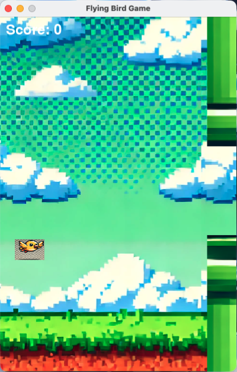

# 飞翔的小鸟游戏

这是一个使用 **Python** 和 **Pygame** 构建的简单“飞翔的小鸟”游戏。玩家控制一只小鸟通过拍动翅膀在一系列管道之间飞行，避免与管道或地面碰撞。

## 目录

- [演示](#演示)
- [功能](#功能)
- [安装](#安装)
- [玩法说明](#玩法说明)
- [配置](#配置)
- [项目结构](#项目结构)
- [未来增强](#未来增强)
- [贡献](#贡献)
- [许可证](#许可证)

## 演示

以下是游戏运行时的截图：



## 功能

- **鸟类拍动机制**：玩家按下空格键控制小鸟向上飞行，重力会持续向下拉动小鸟。
- **动态管道**：带有随机高度的管道会从右侧出现，并且随着游戏进行速度逐渐增加。
- **分数系统**：玩家每成功通过一个管道间隙得 1 分。
- **游戏结束检测**：如果小鸟碰到管道或地面，游戏结束。
- **背景滚动**：背景持续滚动，模拟小鸟在飞行中的效果。
- **音效**：为小鸟拍动和碰撞添加了音效反馈。

## 安装

1. **克隆仓库**：
   ```bash
   git clone https://github.com/1998x-stack/flying_bird.git
   cd flying_bird
   ```

2. **安装依赖**：
   确保已安装 Python 3.x，然后安装 Pygame：
   ```bash
   pip install pygame
   ```

3. **运行游戏**：
   执行 `main.py` 文件以启动游戏。
   ```bash
   python main.py
   ```

## 玩法说明

- 按 **空格键** 让小鸟拍动翅膀并向上飞行。
- 避免碰撞到管道和地面。
- 随着游戏进行，管道的速度会不断增加，游戏难度也会提升。
- 游戏屏幕顶部会显示当前的得分，每通过一个管道增加 1 分。

## 配置

您可以通过修改 `config.py` 文件来调整游戏设置。以下是一些关键设置：

```python
# config.py

# 屏幕尺寸
SCREEN_WIDTH = 400
SCREEN_HEIGHT = 600

# 小鸟设置
BIRD_START_X = 50
BIRD_START_Y = 300
BIRD_SCALE = (50, 35)

# 重力和拍动强度
GRAVITY = 0.25
FLAP_STRENGTH = -6  # 调整这个值以增加或减少拍动强度

# 管道设置
PIPE_GAP = 150
PIPE_VELOCITY = 4
```

- **FLAP_STRENGTH**：调整小鸟拍动翅膀时向上的移动强度。
- **PIPE_VELOCITY**：控制管道从右向左移动的速度。
- **PIPE_GAP**：设置上下管道之间的间隙。

## 项目结构

项目的文件结构如下：

```
flying_bird_game/
│
├── assets/               # 包含游戏资源（图片和音效）
│   ├── images/
│   │   ├── bird.png
│   │   ├── background.png
│   │   └── pipe.png
│   └── sounds/
│       ├── flap.wav
│       └── hit.wav
│
├── config.py             # 游戏设置和配置（常量）
├── game.py               # 游戏主循环和整体逻辑
├── bird.py               # 小鸟对象类
├── pipe.py               # 管道障碍物类
├── background.py         # 背景滚动类
└── main.py               # 游戏入口
```

- **`assets/`**：包含所有游戏所需的图片和声音文件。
- **`config.py`**：存储游戏配置，如屏幕尺寸、重力、速度等。
- **`game.py`**：管理游戏循环，连接小鸟、管道和背景组件。
- **`bird.py`**：处理小鸟的移动、拍动和碰撞。
- **`pipe.py`**：管理管道障碍物及其移动。
- **`background.py`**：处理背景滚动效果。
- **`main.py`**：游戏的启动入口。

## 未来增强

未来可以添加的一些潜在功能以提升游戏体验：

- **最高分记录**：记录和显示玩家取得的最高分。
- **暂停功能**：增加暂停和继续游戏的功能。
- **难度级别**：引入不同的难度级别（如简单、中等、困难）。
- **更多障碍物**：添加新的障碍物类型，增加游戏挑战。
- **道具功能**：引入道具，如无敌模式或慢动作等，持续一段时间。

## 贡献

如果您希望为该项目做出贡献，请随时 fork 仓库并提交 Pull Request，欢迎任何形式的贡献！

1. Fork 这个项目。
2. 创建一个功能分支 (`git checkout -b feature/AmazingFeature`)。
3. 提交您的更改 (`git commit -m 'Add some AmazingFeature'`)。
4. 推送到分支 (`git push origin feature/AmazingFeature`)。
5. 打开一个 Pull Request。

## 许可证

该项目基于 MIT 许可证开源 - 请参阅 [LICENSE](LICENSE) 文件了解更多详情。